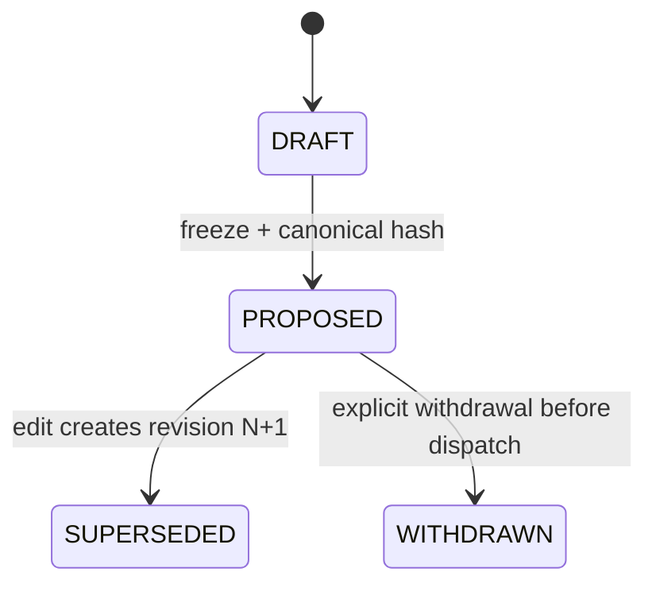
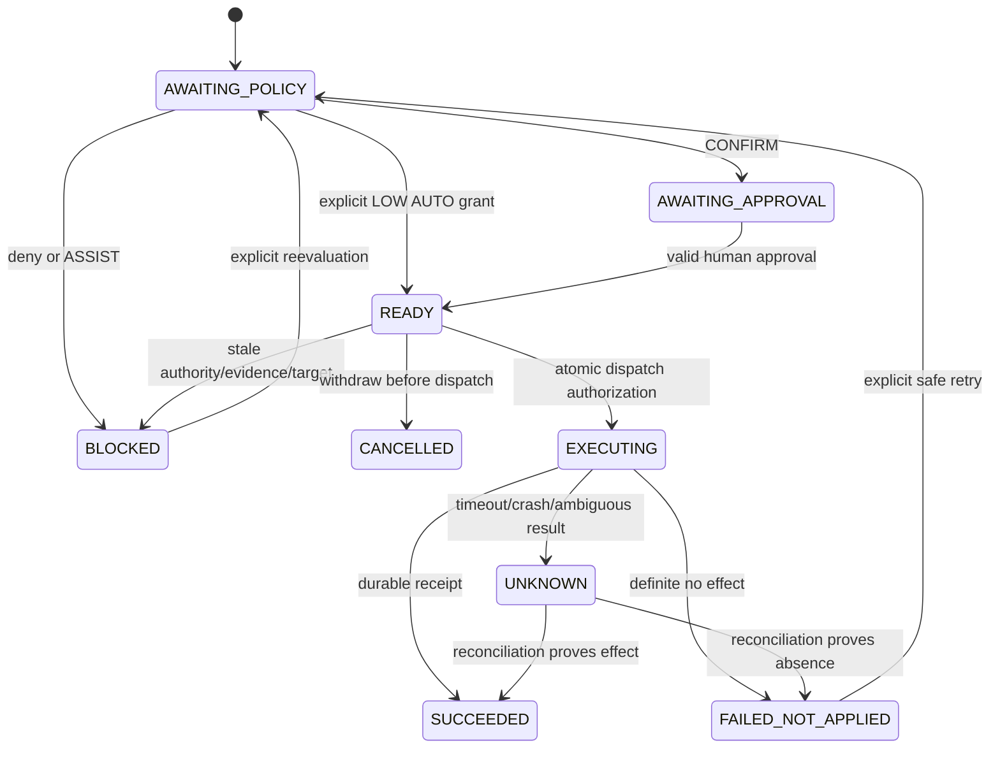

# Минимальный action trust contract

PROPOSED. Ничего из описанных новых сущностей/endpoint здесь не реализовано.

Общие ObjectRef/VersionPin и трактовка bound versions определены в
[integration glossary](../integration/glossary.md). В I03/I04/I05 и §6 ниже
version означает semantic pin, не изменяемый assessment.record_version.
last_checked_at не инвалидирует approval, но live ACL/freshness проверка обязательна.
Pre-action Context/Claim events используют тот же audit writer со stream subject,
без фиктивного action; [единая транзакционная граница](../integration/ownership-transactions.md).

## 1. Независимые оси

| Ось | Значения | Семантика |
|---|---|---|
| Stage | READ / ANALYZE / DRAFT / PROPOSE / EXECUTE | PROPOSE — запись предложения, не бизнес-эффект |
| Autonomy | ASSIST / CONFIRM / AUTO | Режим сервера, не команда модели |
| Risk | LOW / MEDIUM / HIGH / CRITICAL / UNKNOWN | UNKNOWN fail-closed; классификатор action catalog задаёт нижнюю границу |
| Reversal | REVERSIBLE / COMPENSATABLE / IRREVERSIBLE | Зависит от конкретного target и эффекта; не означает разрешение undo |
| Business state | См. §3 | Факт действия, а не здоровье worker |
| Job status | queued/running/retrying/completed/failed/dead_letter/cancelled | Существующий BackgroundJob, независим от business state |
| AI data mode | local_only/external_allowed/redacted/metadata_only | Privacy из ProjectAIPolicy, не разрешение EXECUTE |

ASSIST разрешает только стадии до EXECUTE в пределах RBAC/privacy. Даже внутренняя
созданная assigned Task — EXECUTE, если она создаёт обязанность исполнителя.
CONFIRM требует применимого человеческого approval. AUTO требует отдельного
server policy grant только для LOW. Высокая confidence не уменьшает risk и не
повышает autonomy. Model/channel metadata — provenance, а не principal/authority.

## 2. Facade, не второй engine

Логические операции фасада: `freeze`, `evaluate`, `approve/revoke`,
`request_execution`, `reconcile`, `propose_compensation`. Они проверяют общий
контракт и вызывают зарегистрированный существующий domain executor. Реестр
action types статический/серверный: модели не передают имя Python-функции,
произвольный URL, SQL или код для исполнения.

`DomainActionAdapter` — контракт обёртки, не новый provider:

- `describe_effects(target, sealed_payload)` → полный перечень эффектов,
  risk_floor, reversal_class, required_permissions, atomicity/capabilities.
- `validate_target(expected_version, source_refs)` → current / changed / unavailable;
  authority/policy и evidence проверяет facade с владельцами соответствующих API.
- `execute(sealed_revision, attempt_id, action_key, expected_target_version)` →
  APPLIED(receipt), NOT_APPLIED(reason), UNKNOWN(reconcile_ref).
- `reconcile(attempt_ref)` → APPLIED / NOT_APPLIED / UNKNOWN / CONFLICT.
- `describe_compensation(receipt, current_target)` → новый proposal либо unsupported.

Facade не вызывает endpoint с внутренним commit, надеясь на общую транзакцию.
При реализации извлекается минимальный existing domain mutation helper с явным
владельцем транзакции; старый endpoint вызывает его же. Реальные provider adapters,
OrganizerExecutor, Task/TaskHistory и финансовые методы остаются единственными
исполнителями соответствующей логики.

## 3. State machines

Proposal revision неизменяема после freeze:

Business action projection для конкретной ревизии:

Правила переходов, не показанные стрелками:

- Новая revision не может переиспользовать старую READY. SUPERSEDED revision
  блокирует dispatch; уже EXECUTING/UNKNOWN остаётся в истории до reconciliation.
- Approval: GRANTED → REVOKED/EXPIRED/INVALIDATED; consumption фиксируется событием
  DISPATCH_AUTHORIZED, не удаляет первоначальный grant. REJECTED — отдельное решение.
- SUCCEEDED никогда не превращается в «не было действия». Cancel/compensation
  создаёт другой action_id, связанный `compensates_action_id`.
- UNKNOWN не становится FAILED_NOT_APPLIED по истечении таймера или lease.
- Завершившийся job может означать «зафиксирован UNKNOWN/нужен человек», а не
  SUCCEEDED. Job.cancelled не доказывает, что письмо не отправлено.
- В первом пилоте один action = один эффект. Batch — existing OrganizerProposal
  + несколько actions; общий результат PARTIAL получается проекцией дочерних
  ledger receipts. Нет глобальной транзакции над провайдером и БД.

## 4. Инварианты

I01. Только серверный policy grant может включить AUTO для LOW allowlisted типа.
Default-deny при неизвестной policy/risk/capability. DENY сильнее allow.

I02. Request actor определяется аутентификацией; organization/project — проверенным
контекстом. AI, email, документ, channel и service adapter не назначают себе actor,
роль, approver, risk, policy, autonomy. Изменение политики — отдельный human action.

I03. Approval связывает action_id, revision, canonical hash, target identity/version,
evidence/SourceReference/ContextRelation IDs+versions, policy version/hash,
decision conditions, actor scope, risk и exact effects. Approval ID сам по себе
не bearer-token и не даёт права исполнения.

I04. Любое изменение исполняемого payload/адресатов/вложений/target/provider account/
evidence/action version создаёт новую revision и делает старый grant неприменимым.
Даже при одинаковом payload hash новая revision не наследует approval.

I05. Непосредственно перед dispatch повторяются actor/approver roles, tenant ACL,
policy epoch, evidence freshness/access, target preconditions и capabilities.
Переданный клиентом `approved=true` или cached decision не заменяет проверку.

I06. Revocation, expiry, role/policy change и reservation сериализуются по action
и authority/policy epochs. При изменении до dispatch — BLOCKED без эффекта.
После dispatch — запрос остановки best-effort и reconciliation; UI не обещает
отмену уже отправленного запроса. Сетевого атомарного revoke у провайдера нет.

I07. Business idempotency независима от job_id/lease. Несколько jobs/retries
одной операции сходятся на одну action reservation и один receipt.
Stable domain intent связывается с одним action_id. Execution command key
фиксирует revision/hash; новая редакция до dispatch получает новый command key,
но не новую identity бизнес-действия. Один action_id не производит второй эффект
через другую revision/key после EXECUTING, UNKNOWN или SUCCEEDED.

I08. После неоднозначного provider outcome нельзя слепо повторять mutate.
Сначала reconciliation; отсутствие результата в БД не доказательство отсутствия
результата у провайдера. Смена action key не служит обходом UNKNOWN.

I09. Ledger события добавляются, не переписываются. Технический log содержит
IDs, safe code, duration/correlation, без текста, получателей, токенов и вложений.
Payload/receipt content — в ACL-controlled domain storage; ledger хранит refs/hashes.

I10. Reversal class задаётся для проверенной реализации эффекта, не маркетингово.
REVERSIBLE требует контроля target version и условий, при которых обратное
изменение действительно возвращает состояние без скрытых внешних последствий.

I11. Undo/compensation проходит те же права, policy, approval и execution gate.
Не копирует первоначальный approval и не удаляет исходные события.

I12. Corrective email — новая внешняя отправка CONFIRM/IRREVERSIBLE, связанная с
оригиналом. Она не отзывает исходное письмо и не превращает его в REVERSIBLE.

## 5. Канонический payload и version binding

Пилот использует явно описанный `pu-action-c14n-v1`, не заявляет совместимость
с произвольным JSON canonicalization standard. Вход — UTF-8 JSON object;
дубликаты keys, float/NaN/Infinity, невалидный Unicode, неизвестные поля запрещены.
Keys только ASCII; объекты сортируются по key, separators `,`/`:`, без whitespace,
ensure_ascii=false; null/boolean/int/string/array/object допустимы. Integer только
в диапазоне ±(2^53−1) для одинакового представления в API-клиентах. Деньги — decimal
strings + currency, даты ISO, timestamp UTC. Unicode strings не нормализуются
молча; UI и backend показывают одни и те же сохранённые значения. Порядок массивов
значим; evidence refs сортируются по ID/version **до** freeze, затем неизменяемы.

Hash: SHA-256(UTF-8 canonical `envelope`), lowercase hex. Сам hash, approval ID,
job ID, execution times и mutable status в envelope не входят. Входят: schema/
action type version, action_id/revision, tenant/project, requested_by principal,
target identity/version, exact effects/payload (в пилотных примерах inline),
evidence/context refs, policy binding, risk/autonomy/reversal, idempotency key,
executor/renderer version. Для sensitive payload вместо inline допустим immutable
payload_ref + content_hash; resolver обязан проверить hash полученных bytes.

Для send до approval фиксируются конечные To/Cc/Bcc, subject/body/MIME parts,
attachment version/hash, sending account, thread/reply refs, renderer version.
Нельзя вычислять изменяемого адресата из source_sender уже после approval.
Транспортные Date/Message-ID либо фиксируются до freeze, либо политика явно
ограничивает допустимые служебные изменения; они не меняют содержание эффекта.
Смена значимого поведения adapter/renderer требует новой revision/approval.

## 6. Минимальная логическая схема — без миграций

Это contract records, не требование создать независимый набор движков/таблиц.
Физическое размещение согласует интегратор; доменные IDs пока integer и
используются через typed references, массовая UUID-миграция не нужна.

| Record | Минимальные поля и ограничения |
|---|---|
| ActionProposalRevision | action_id UUID; revision int; org/project; domain_ref; stage; action_type/version; immutable envelope/payload_ref/hash; source/evidence/context refs; provenance; created_by/at; unique(action_id, revision) |
| ActionPolicyRevision | policy_id/version/hash; tenant/scope; active/expiry; allowed stage/type/risk/effect bounds; role/channel/provider/data restrictions; approver rules; updated_by; immutable versions; deny-by-default |
| PolicyDecision | decision_id; action_id/revision/hash; policy binding; effective mode/risk; allow/deny/requires_human; safe reasons; evaluated_at/valid_until; actor/role/evidence/target epochs; granted_by=server_policy for AUTO |
| ApprovalEvent | event_id; action/revision/hash; target/evidence/policy binding digest; decision GRANTED/REJECTED/REVOKED/INVALIDATED; approver principal/role snapshot; timestamp/expiry; referenced prior grant; unique grant command key; human grant never fabricated from legacy status |
| ActionExecution (projection) | unique(org_id, action_id); current_revision/hash; stable domain_intent binding; business_state; reservation/version/fence; active_attempt; last_receipt_ref; one active effect per action across revisions; compare-and-swap |
| ExecutionCommand binding | immutable org + idempotency_key → action_id/revision/hash; unique(org_id, idempotency_key); retry того же command возвращает состояние, смена hash/revision даёт conflict; не очередь и не второй executor |
| ExecutionAttempt | attempt_id; action/revision; decision/grant refs; dispatch_authorized_at; authority epochs; job_ref optional; provider/account scope; request_hash/key; APPLIED/NOT_APPLIED/UNKNOWN; safe error; receipt_ref; timestamps |
| LedgerEvent (AuditLog extension/facade) | event_id; per-action sequence; org/project; actor/agent provenance; action/revision/hash; source/context/evidence refs; decision/grant/attempt/job refs; type/outcome/error; domain before/after refs; provider receipt/external ID refs; compensates_action_id; UTC/correlation; unique(action_id, sequence) |

Approval/ledger события append-oriented; текущие состояния строятся проекцией.
AuditLog.details остаётся legacy-форматом; новые типизированные поля/связанная
таблица расширения идут через существующий audit writer, не второй audit engine.
RESTRICT/tombstone на ссылки вместо каскадного исчезновения audit. Retention/DLP
применяется к content storage, сохранение минимальных фактов/хешей — по политике;
append-oriented не означает хранить PII вечно. DB writer role не имеет UPDATE/
DELETE ledger; проверяются порядок, уникальность и контролируемые retention events.
Hash chain — возможное усиление, не замена RBAC/backup и не обещание tamper-proof.

SourceReference/Evidence/ContextRelation принадлежат другим потокам. Здесь только
`{id, version}` и resolution result: tenant/access, current/stale/unavailable,
integrity, verified/unverified, policy-allowed freshness. Не копировать locator,
страницы, извлечённый текст или relations в новую конкурирующую модель.

## 7. Execution, конкуренция и неизвестный outcome

1. Запрос исполнения содержит только action_id/revision/hash, authenticated actor
   и Idempotency-Key. Сверка key: тот же hash/revision → существующее состояние;
   другой hash/revision → 409 IDEMPOTENCY_CONFLICT, не cached success.
   Для исправленной revision до первого dispatch сервер выдаёт новый command key;
   stable action/domain intent остаётся прежним. После dispatch редактирование
   не открывает новый эффект: сначала outcome/reconciliation, а для действительно
   нового действия — отдельный явный intent с собственным approval. Projection CAS
   запрещает две действующие revisions даже с разными command keys.
2. Durable intent создаётся до dispatch. Existing queue остаётся транспортом:
   payload только action_id/revision/attempt_id/correlation. Commit intent и enqueue
   согласуются outbox-подобным переиспользуемым журналом pending-dispatch с
   повторяемой постановкой; текущий queue.enqueue сам делает commit — это явный
   integration gap, не якобы готовая атомарность.
3. При claim facade вновь загружает sealed revision и текущую policy/права.
   Под блокировкой action/authority epochs сравнивает grant, expiry и snapshots;
   резервирует единственный attempt и append DISPATCH_AUTHORIZED. Это линейная
   точка разрешения. Worker не получает роль approve и не выбирает нового actor.
   Все writers отзыва grant/смены policy/ролей обязаны участвовать в том же
   протоколе epochs/locks. Просто перечитать роли, не согласовав их writers,
   недостаточно для обещанной сериализации. Если API evidence/target другого
   потока не предоставляет сравнимую версию/проверку, gate не утверждает атомарную
   свежесть: ограничение фиксируется и такой эффект не допускается в AUTO.
4. Внутренний DB-only task: domain mutation, idempotency receipt и SUCCEEDED event
   коммитятся одной транзакцией. При crash после commit retry читает receipt.
   Общие helpers не должны делать скрытые commit/внешние вызовы.
5. Внешний эффект: durable attempt записан прежде provider call; используется
   provider idempotency key/conditional target update, если capability существует.
   При отсутствии conditional-write строгая гарантия freshness не доказана:
   риск повышается/эффект не допускается в AUTO; для пилота send только CONFIRM.
6. Provider success → receipt + SUCCEEDED ledger. Timeout, process crash или DB
   failure после dispatch → UNKNOWN. Другой worker после lease expiry только
   reconciles этот attempt, не создаёт повторный provider call.
7. Достоверный поиск по provider idempotency key/receipt/external ID+account
   возвращает APPLIED. Только authoritative NOT_APPLIED допускает safe retry после
   нового execution gate; пустой eventually-consistent поиск недостаточен.
   Неустранимая неопределённость остаётся UNKNOWN и требует человека. Gmail send
   в текущем adapter не имеет доказанного provider idempotency/reconciliation
   контракта: повторная отправка автоматически запрещена.
8. Старый worker с потерянным fence не коммитит финальный projection. Полученный
   им receipt можно append как наблюдение для reconciliation; он не делает новый
   эффект. Fence защищает БД, но не останавливает уже идущий provider request.

Для revoke/role-change после dispatch фиксируются effective_at и
`may_have_executed=true`. Если provider подтверждает cancel-before-effect —
NOT_APPLIED; иначе UNKNOWN/SUCCEEDED и отдельная compensation. Просроченный
grant нельзя использовать для нового dispatch. Права read/reconcile также
проверяются; отсутствие прав на mutate не повод потерять уже полученный receipt.
