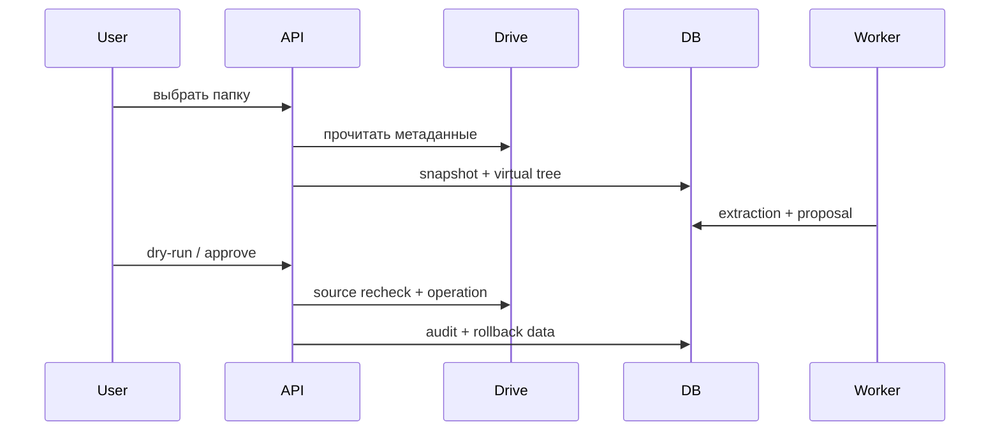
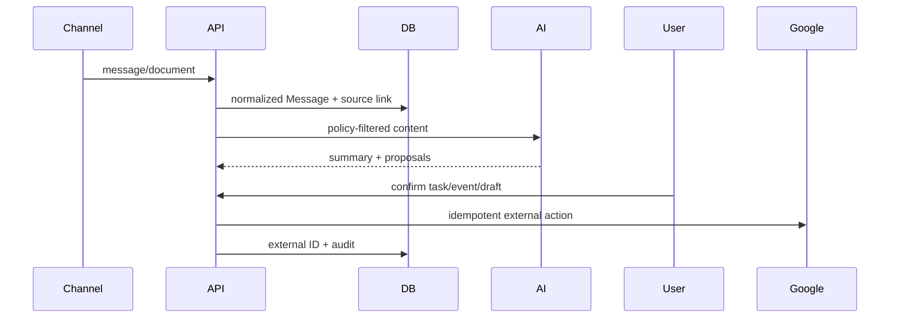

# PU Workspace — контракты адаптеров и каталог ошибок

## Общие правила API

- Авторизация и проверка роли выполняются server-side для каждого project-scoped ресурса.
- Списки поддерживают ограничение размера, фильтры и смещение; массовая обработка возвращает job/session ID.
- Внешнее действие хранит внешний ID и выполняется идемпотентно.
- Ошибки не содержат секретов или полного содержимого документа.
- Корреляция обеспечивается ID сообщения, сессии, снимка, предложения и операции в бизнес-аудите.

## Message Processing Contract

Вход: `project_id`, `source_type`, `source_external_id`, имя/отправитель, ссылка на источник, thread ID, содержимое. Результат: нормализованное сообщение, подтверждаемая связь с проектом/договором, summary, предложения задач/рисков/ответов. Повтор того же `source_external_id` не создаёт дубль.

## AI Proposal Contract

Каждый AI-вывод содержит evidence/confidence и остаётся предложением. Внешний вызов подчиняется проектному режиму `local_only`, `redacted`, `metadata_only` или `external_allowed`. В аудите фиксируются provider, model, policy mode и prompt version, но не переданный текст.

## Google adapters

- Drive: OAuth, snapshot/virtual tree, повторная проверка source metadata перед изменением, idempotency и rollback.
- Tasks: создание/обновление только после подтверждения, хранение external task ID и source links.
- Calendar: подтверждаемое событие, timezone и external event ID.
- Gmail: разрешённая выборка писем, message/thread ID, draft отдельно от send, повторная отправка блокируется external ID.

## Каталог ошибок

| Код/статус | Значение | Действие |
|---|---|---|
| `400` | неверный ввод или неподдерживаемый источник | исправить запрос |
| `401` | нет действующей сессии | войти снова |
| `403` | недостаточно прав | запросить роль |
| `404` | объект не найден в разрешённой области | проверить project/object ID |
| `409 conflict_source_changed` | источник изменился после анализа | повторно проанализировать |
| `409` | неверное состояние workflow или исчерпаны повторы | проверить статус/dead-letter |
| `422` | действие невозможно по данным объекта | дополнить связь/адрес/контекст |
| `502` | внешний адаптер временно недоступен | повторить через очередь |
| `failed` | попытка завершилась ошибкой | допускается ручной retry |
| `dead_letter` | исчерпаны три попытки | диагностика администратора |
| `rollback_partial` | компенсирующий откат выполнен не полностью | ручная проверка операций |

## Последовательности

