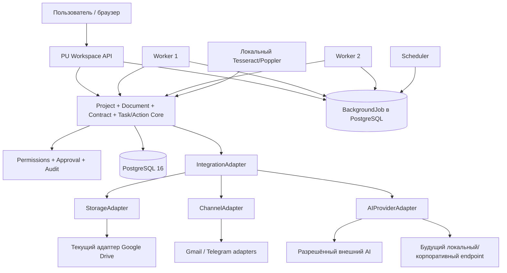

# Архитектурная схема

Границы доверия:

1. Core не должен зависеть от идентификаторов конкретного провайдера.
2. Секреты задаются через окружение и не входят в поставку или публичное досье.
3. Оригиналы документов не изменяются при анализе; стандартизация выполняется в безопасной копии.
4. Внешний AI вызывается только через `AIProviderAdapter` и проектную политику.
5. Возможность полностью отключить внешний AI должна быть подтверждена приёмочным тестом выбранного релиза.

Исходная техническая спецификация: [`../../architecture-v5.2-provider-agnostic.md`](../../architecture-v5.2-provider-agnostic.md).
